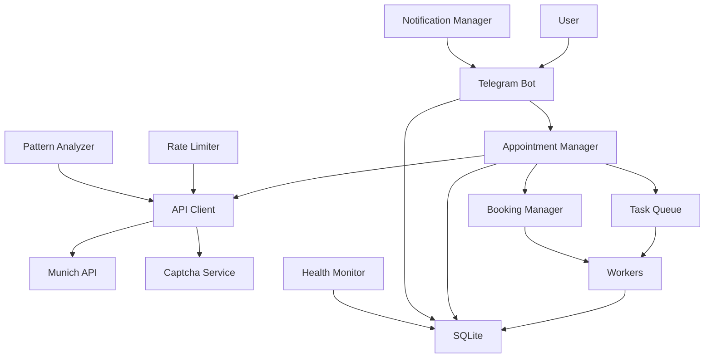
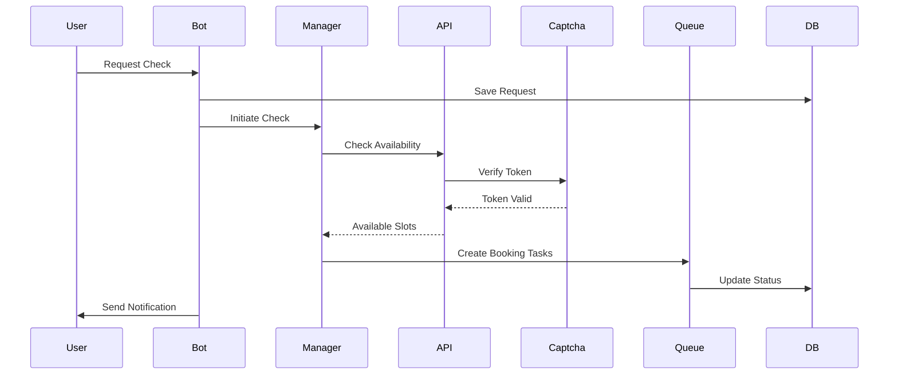
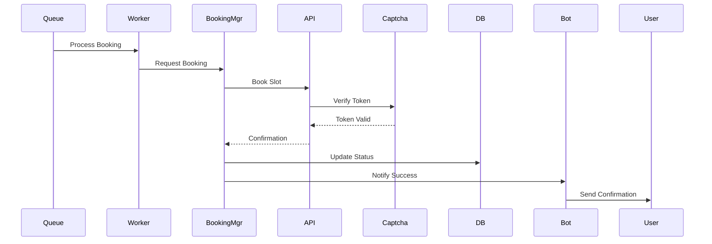
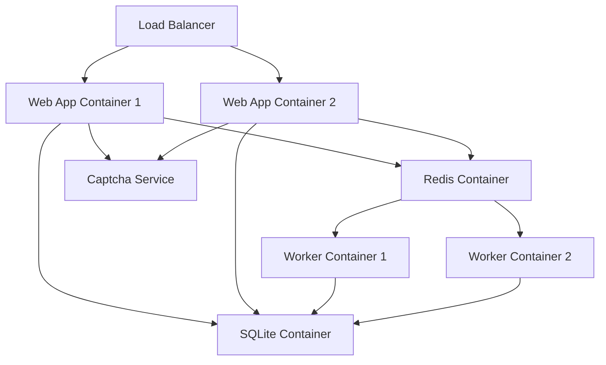

# Munich Termin Automator - Architecture Documentation

## System Architecture Overview

### 1. Core Components

### 2. Component Details

#### 2.1 Telegram Bot (`src/bot/`)
- Handles user interactions
- Manages conversation flows
- Processes commands and callbacks
- Sends rich-formatted notifications
- Implements notification preferences
- Manages daily digests

#### 2.2 Appointment Manager (`src/manager/`)
- Coordinates appointment checking
- Manages parallel booking operations
- Handles task distribution
- Implements retry logic
- Coordinates with Booking Manager
- Manages captcha verification

#### 2.3 API Client (`src/api/`)
- Manages API interactions
- Implements rate limiting
- Handles request optimization
- Provides response parsing
- Integrates with Captcha Service
- Implements pattern analysis

#### 2.4 Captcha Service (`src/captcha/`)
- Handles FriendlyCaptcha challenges
- Manages token lifecycle
- Implements token caching
- Provides verification status
- Handles token refresh
- Manages error recovery

#### 2.5 Booking Manager (`src/booking/`)
- Coordinates parallel booking attempts
- Manages booking timeouts
- Implements retry strategies
- Handles concurrency control
- Tracks booking success rates
- Manages booking priorities

#### 2.6 Notification Manager (`src/notifications/`)
- Manages rich message formatting
- Handles notification preferences
- Implements cooldown periods
- Manages daily digests
- Tracks delivery status
- Handles error recovery

#### 2.7 Task Queue System
- Uses Celery for task management
- Redis as message broker
- Handles asynchronous operations
- Manages worker distribution
- Implements task prioritization
- Handles task timeouts

#### 2.8 Database Layer (`src/database/`)
- SQLite for data persistence
- Handles data models
- Manages transactions
- Implements caching
- Tracks API requests
- Manages captcha tokens

#### 2.9 Monitoring System (`src/monitoring/`)
- Health checks
- Performance metrics
- Error tracking
- System analytics
- Pattern analysis
- Bot detection

#### 2.10 Rate Limiter (`src/rate_limiter/`)
- Implements token bucket algorithm
- Manages rate limits per operation
- Handles burst protection
- Provides quota management
- Implements adaptive limiting
- Tracks usage patterns

### 3. Data Flow

#### 3.1 Appointment Check Flow

#### 3.2 Booking Flow

### 4. Security Architecture

#### 4.1 Authentication & Authorization
- Telegram Bot Token security
- API request signing
- Database access control
- Rate limiting enforcement
- Captcha verification
- Pattern-based bot detection

#### 4.2 Data Protection
- Sensitive data encryption
- Secure configuration management
- Session handling
- Error message sanitization
- Token management
- Request pattern analysis

### 5. Scalability Design

#### 5.1 Horizontal Scaling
- Multiple worker processes
- Database optimization
- Load balancing capability
- Cache distribution
- Parallel booking support
- Distributed rate limiting

#### 5.2 Performance Optimization
- Connection pooling
- Request caching
- Batch processing
- Asynchronous operations
- Token caching
- Pattern analysis optimization

### 6. Monitoring Architecture

#### 6.1 Health Monitoring
- Service health checks
- Database connectivity
- API availability
- Worker status
- Captcha service status
- Rate limit usage

#### 6.2 Performance Monitoring
- Response times
- Queue lengths
- Error rates
- Resource utilization
- Booking success rates
- Pattern analysis metrics

### 7. Deployment Architecture

#### 7.1 Container Structure

#### 7.2 Network Architecture
- Internal network isolation
- External access control
- Service discovery
- Health check endpoints
- Rate limit monitoring
- Pattern analysis endpoints

### 8. Error Handling Architecture

#### 8.1 Error Categories
- API Errors
- Database Errors
- Network Errors
- Business Logic Errors
- Captcha Errors
- Pattern Analysis Errors

#### 8.2 Recovery Strategies
- Retry mechanisms
- Circuit breakers
- Fallback options
- Error escalation
- Token refresh
- Pattern adjustment

### 9. Future Considerations

#### 9.1 Planned Improvements
- Distributed rate limiting
- Enhanced anti-bot measures
- Advanced monitoring
- Performance optimizations
- Machine learning for pattern detection
- Adaptive rate limiting

#### 9.2 Scalability Roadmap
- Multi-region support
- Enhanced caching
- Load prediction
- Auto-scaling
- Distributed booking
- Advanced pattern analysis 