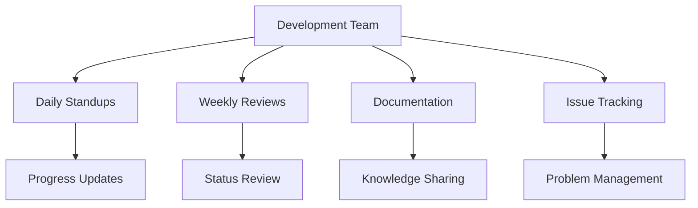
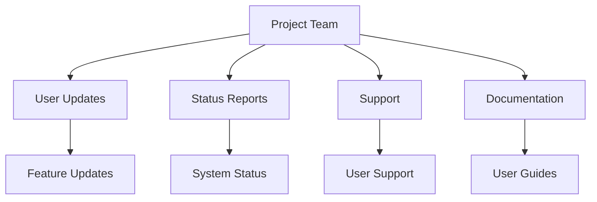

# Munich Termin Automator (MTA) - Communication Registry

## Status
- **Version**: 1.0.0
- **Status**: In Development
- **Last Updated**: Current
- **Next Review**: Daily

## Communication Channels

### 1. Internal Communication


### 2. External Communication


## Communication Schedule

### 1. Regular Updates
| Activity | Frequency | Audience | Format | Status |
|----------|-----------|----------|---------|---------|
| Daily Standups | Daily | Development Team | Video Call | Active |
| Weekly Reviews | Weekly | Development Team | Meeting | Active |
| Monthly Reports | Monthly | Stakeholders | Report | Planned |
| Issue Tracking | Daily | Development Team | Issue Tracker | Active |
| Documentation Updates | As needed | All | Memory Bank | Active |

### 2. Special Updates
| Activity | Trigger | Audience | Format | Status |
|----------|---------|----------|---------|---------|
| Feature Releases | New Version | Users | Announcement | Planned |
| System Status | Issues | Users | Notification | Planned |
| Support Responses | User Requests | Users | Direct Message | Planned |
| Training Sessions | New Features | Users | Video | Planned |
| Feedback Collection | Milestones | Users | Survey | Planned |

## Communication Templates

### 1. Daily Updates
```markdown
## Daily Update - [DATE]

### Completed
- [Task 1]
- [Task 2]
- [Task 3]

### In Progress
- [Task 4]
- [Task 5]

### Blocked
- [Issue 1]
- [Issue 2]

### Next Steps
- [Action 1]
- [Action 2]
```

### 2. Weekly Reviews
```markdown
## Weekly Review - [DATE]

### Progress
- [Milestone 1]
- [Milestone 2]
- [Milestone 3]

### Challenges
- [Challenge 1]
- [Challenge 2]

### Solutions
- [Solution 1]
- [Solution 2]

### Next Week
- [Plan 1]
- [Plan 2]
```

### 3. Monthly Reports
```markdown
## Monthly Report - [MONTH]

### Achievements
- [Achievement 1]
- [Achievement 2]

### Metrics
- [Metric 1]
- [Metric 2]

### Challenges
- [Challenge 1]
- [Challenge 2]

### Next Month
- [Plan 1]
- [Plan 2]
```

### 4. Feature Announcements
```markdown
## New Feature: [FEATURE NAME]

### What's New
- [Feature 1]
- [Feature 2]

### Benefits
- [Benefit 1]
- [Benefit 2]

### How to Use
- [Step 1]
- [Step 2]

### Feedback
- [Feedback Channel]
```

## Stakeholder Communication

### 1. Development Team
- Daily standups
- Weekly reviews
- Issue tracking
- Documentation updates
- Code reviews

### 2. Users
- Feature announcements
- Status updates
- Support responses
- Training materials
- Feedback collection

### 3. Stakeholders
- Monthly reports
- Status updates
- Progress reviews
- Budget updates
- Risk assessments

## Documentation Updates

### 1. Technical Documentation
- Architecture updates
- API changes
- System changes
- Performance updates
- Security updates

### 2. User Documentation
- Feature guides
- User manuals
- FAQs
- Troubleshooting guides
- Training materials

### 3. Project Documentation
- Progress updates
- Timeline changes
- Resource updates
- Risk updates
- Budget updates

## Communication Tools

### 1. Development Tools
- Issue Tracker
- Code Repository
- CI/CD Pipeline
- Monitoring System
- Logging System

### 2. Communication Tools
- Video Conferencing
- Chat Platform
- Email System
- Documentation System
- Feedback System

### 3. Project Management Tools
- Task Tracker
- Timeline Tool
- Resource Manager
- Risk Tracker
- Budget Tracker

## Communication Guidelines

### 1. General Guidelines
- Clear and concise
- Professional tone
- Timely updates
- Consistent format
- Proper audience

### 2. Technical Guidelines
- Accurate information
- Proper terminology
- Clear instructions
- Version control
- Change tracking

### 3. User Guidelines
- User-friendly language
- Clear examples
- Step-by-step guides
- Visual aids
- Feedback channels

## Communication History

### 1. Recent Updates
- Project initialization
- Development environment setup
- Core documentation
- Basic architecture
- Initial planning

### 2. Upcoming Updates
- Feature announcements
- Status reports
- Training sessions
- Feedback collection
- Support responses

### 3. Planned Updates
- Monthly reports
- Quarterly reviews
- Annual summaries
- Strategic updates
- Resource updates

## Communication Metrics

### 1. Response Times
- Support requests: Target < 24h
- Bug reports: Target < 48h
- Feature requests: Target < 72h
- Documentation updates: Target < 24h
- Status updates: Target < 12h

### 2. Update Frequency
- Daily updates: Every day
- Weekly reviews: Every week
- Monthly reports: Every month
- Feature announcements: As needed
- Status updates: As needed

### 3. Engagement Metrics
- User participation
- Feedback response
- Support resolution
- Documentation usage
- Training attendance

## Communication Plan

### 1. Short-term Plan
- Complete initial documentation
- Set up communication channels
- Establish update schedule
- Create templates
- Train team members

### 2. Medium-term Plan
- Implement feedback system
- Set up support system
- Create training materials
- Establish metrics
- Optimize processes

### 3. Long-term Plan
- Scale communication system
- Enhance user engagement
- Improve documentation
- Optimize resources
- Measure effectiveness 