# Munich Termin Automator (MTA) - Knowledge Graph

## Status
- **Version**: 1.0.0
- **Status**: In Development
- **Last Updated**: Current
- **Next Review**: Daily

## 1. System Components

### 1.1 Core Components
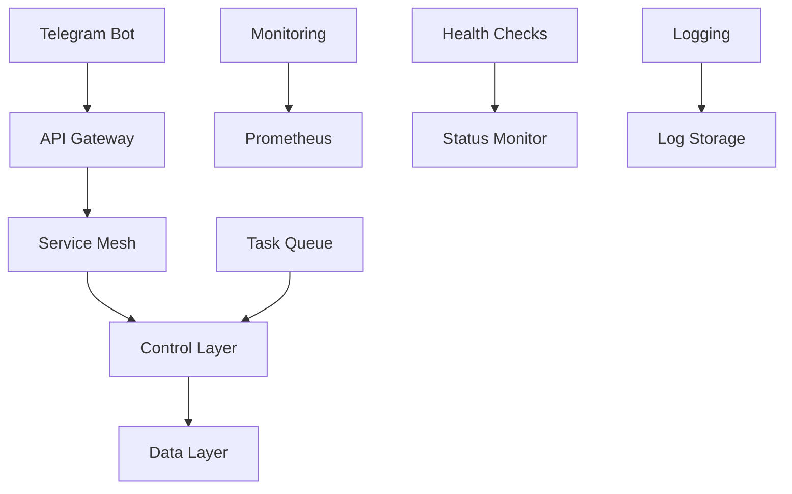

### 1.2 Component Relationships
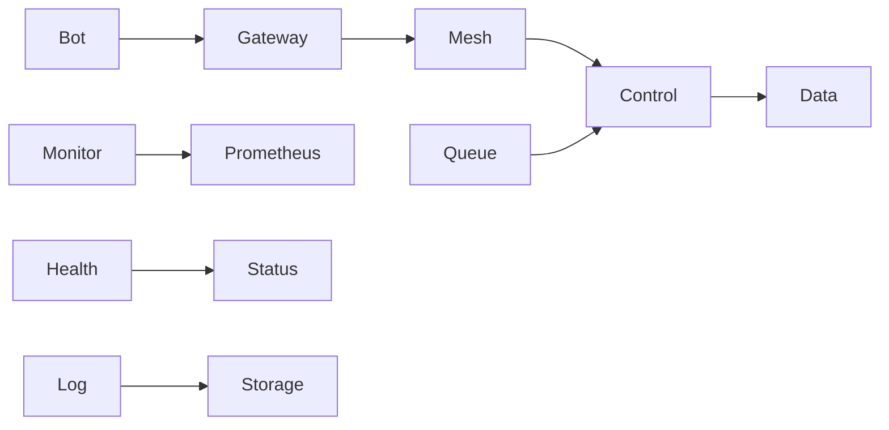

## 2. Data Flow

### 2.1 User Interaction Flow
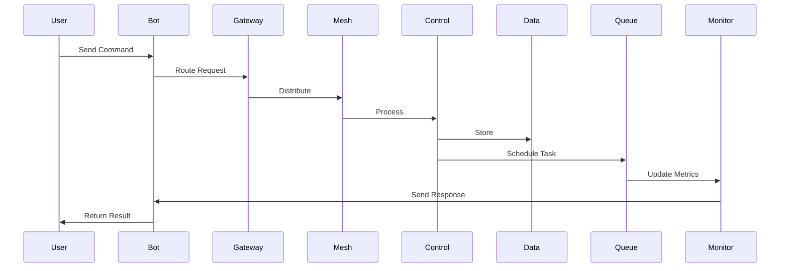

### 2.2 Background Task Flow
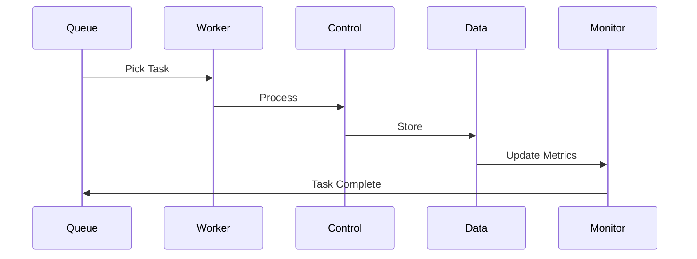

## 3. Security Flow

### 3.1 Authentication Flow
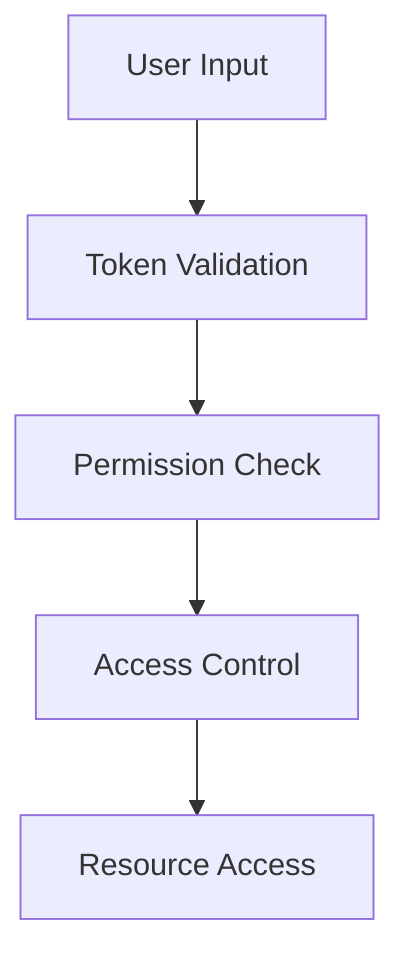

### 3.2 Authorization Flow
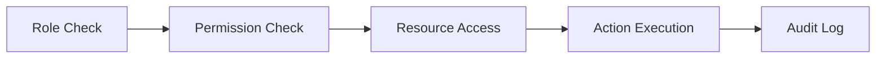

## 4. Monitoring Flow

### 4.1 Metrics Collection
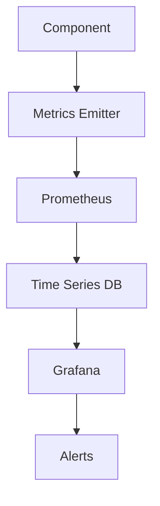

### 4.2 Health Monitoring
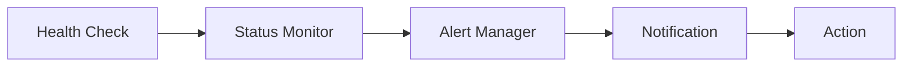

## 5. Error Handling

### 5.1 Error Flow
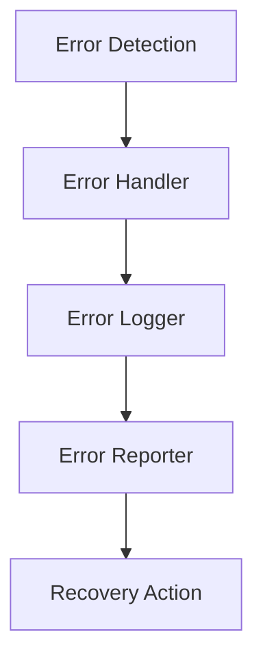

### 5.2 Recovery Flow
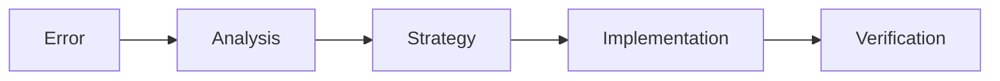

## 6. Performance Flow

### 6.1 Caching Strategy
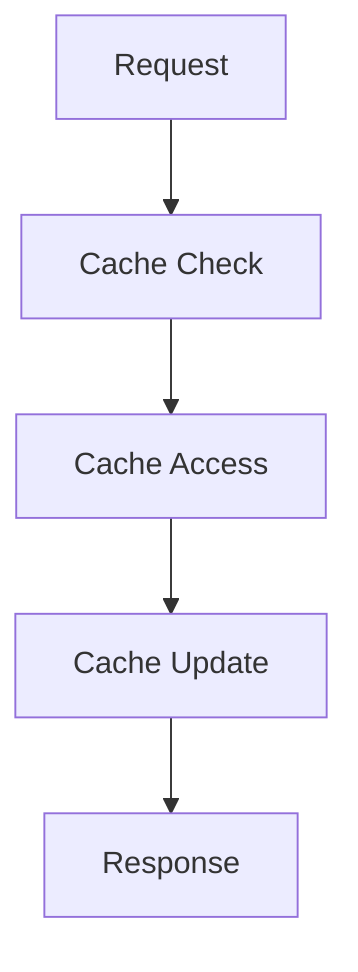

### 6.2 Load Balancing
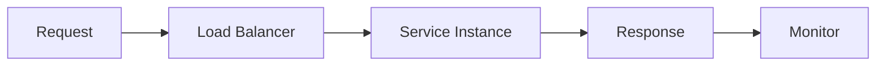

## 7. Scaling Flow

### 7.1 Horizontal Scaling
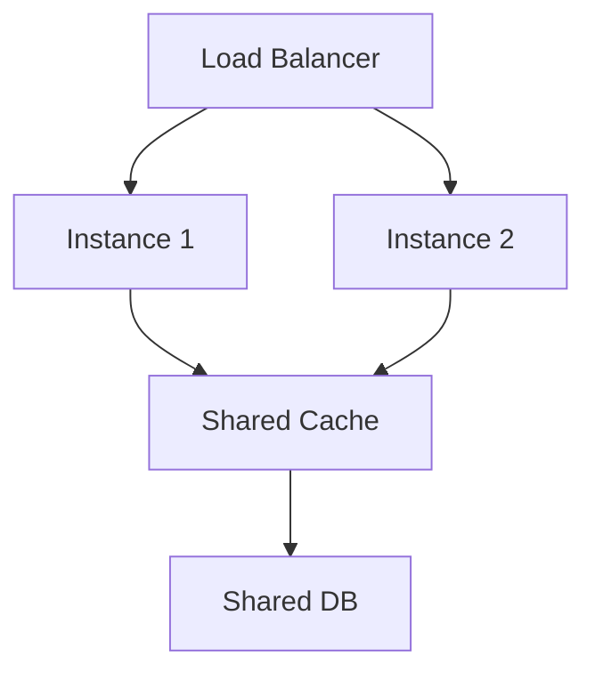

### 7.2 Vertical Scaling
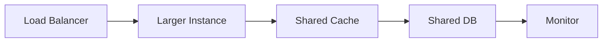

## 8. Development Flow

### 8.1 Development Process
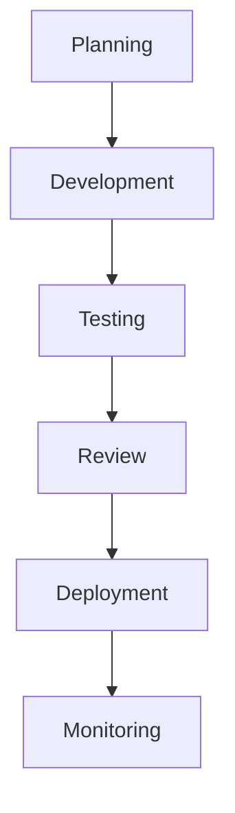

### 8.2 Testing Process
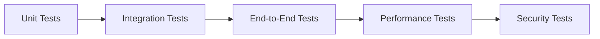

## 9. Documentation Flow

### 9.1 Documentation Process
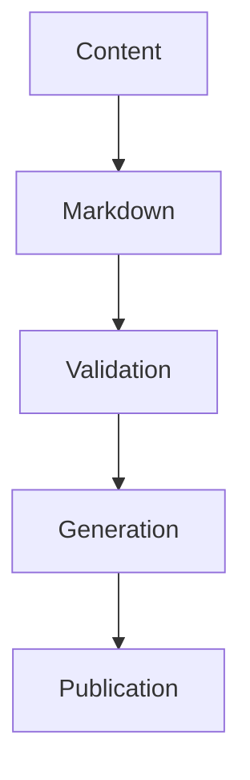

### 9.2 Review Process
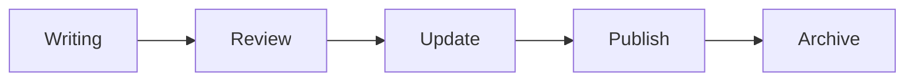

## 10. Component Dependencies

### 10.1 System Dependencies
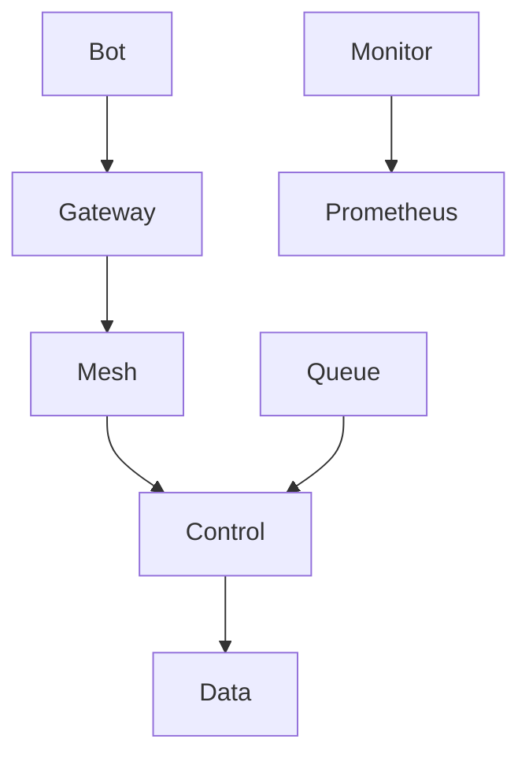

### 10.2 Service Dependencies
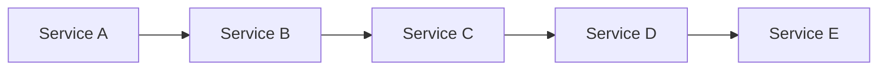

## 11. Knowledge Base

### 11.1 Knowledge Structure
```mermaid
graph TD
    A[Project Knowledge] --> B[Technical]
    A --> C[Process]
    A --> D[User]
    B --> E[Implementation]
    C --> E
    D --> E
```

### 11.2 Knowledge Flow
```mermaid
graph LR
    A[Discovery] --> B[Documentation]
    B --> C[Review]
    C --> D[Update]
    D --> E[Application]
```

## 12. System Integration

### 12.1 Integration Flow
```mermaid
graph TD
    A[External API] --> B[API Client]
    B --> C[Rate Limiter]
    C --> D[Service Layer]
    D --> E[Database]
```

### 12.2 Service Flow
```mermaid
graph LR
    A[Service A] --> B[Service B]
    B --> C[Service C]
    C --> D[Service D]
    D --> E[Service E]
``` 