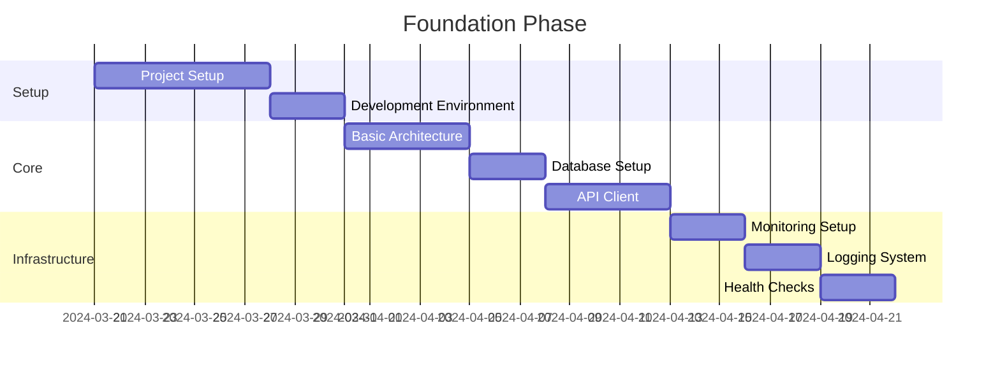
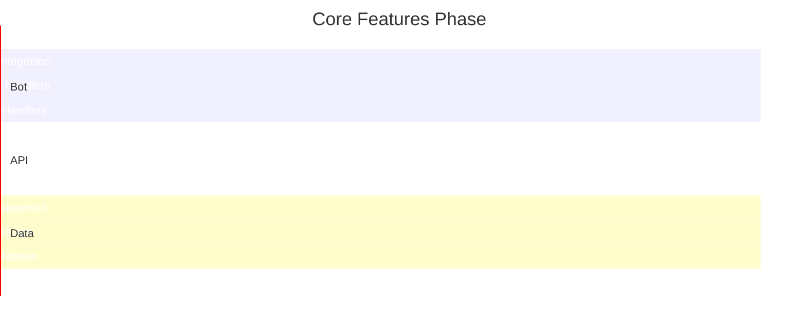
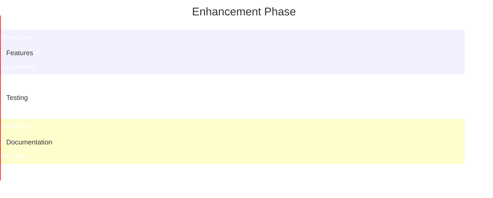
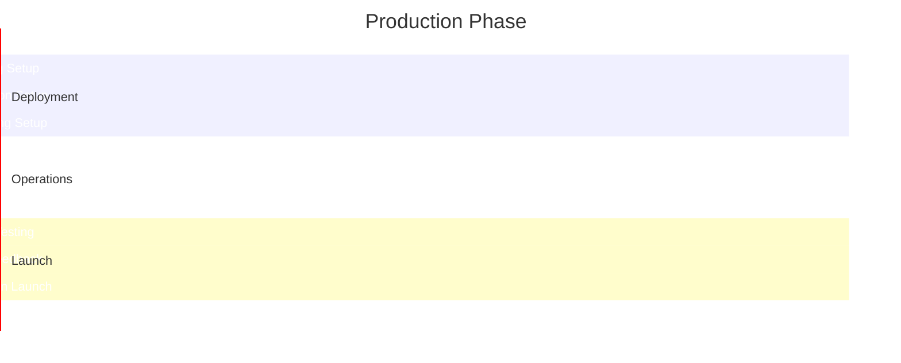

# Munich Termin Automator (MTA) - Timeline

## Status
- **Version**: 1.0.0
- **Status**: In Development
- **Last Updated**: Current
- **Next Review**: Daily

## Project Phases

### 1. Foundation Phase (Current)

### 2. Core Features Phase

### 3. Enhancement Phase

### 4. Production Phase

## Development Timeline

### Sprint 1 (Current)
- Project Setup
  - [x] Initialize project structure
  - [x] Set up development environment
  - [x] Configure version control
  - [ ] Set up CI/CD pipeline

### Sprint 2
- Core Architecture
  - [ ] Design system architecture
  - [ ] Implement basic components
  - [ ] Set up database models
  - [ ] Configure API client

### Sprint 3
- Infrastructure
  - [ ] Set up monitoring system
  - [ ] Configure logging system
  - [ ] Implement health checks
  - [ ] Set up task queue

### Sprint 4
- Bot Integration
  - [ ] Implement Telegram bot
  - [ ] Add command handlers
  - [ ] Set up message handlers
  - [ ] Configure event system

### Sprint 5
- Appointment System
  - [ ] Implement appointment checking
  - [ ] Add booking system
  - [ ] Set up notifications
  - [ ] Configure user preferences

### Sprint 6
- Data Management
  - [ ] Implement user management
  - [ ] Set up data storage
  - [ ] Add data validation
  - [ ] Configure backup system

### Sprint 7
- Testing
  - [ ] Write unit tests
  - [ ] Add integration tests
  - [ ] Implement end-to-end tests
  - [ ] Set up test automation

### Sprint 8
- Documentation
  - [ ] Write API documentation
  - [ ] Create user guide
  - [ ] Add deployment guide
  - [ ] Document system architecture

### Sprint 9
- Deployment
  - [ ] Set up staging environment
  - [ ] Configure production environment
  - [ ] Set up monitoring
  - [ ] Implement backup system

### Sprint 10
- Launch
  - [ ] Conduct performance testing
  - [ ] Perform security audit
  - [ ] Run load testing
  - [ ] Launch beta version

## Milestones

### 1. Foundation Complete
- [x] Project structure initialized
- [x] Development environment set up
- [x] Basic architecture implemented
- [ ] Core components ready

### 2. Core Features Complete
- [ ] Telegram bot functional
- [ ] Appointment system working
- [ ] Booking system operational
- [ ] Notification system active

### 3. Enhancement Complete
- [ ] Advanced monitoring implemented
- [ ] Performance optimized
- [ ] Security enhanced
- [ ] Testing complete

### 4. Production Ready
- [ ] Staging environment ready
- [ ] Production environment configured
- [ ] Monitoring system active
- [ ] Launch checklist complete

## Dependencies

### Critical Path
1. Project Setup → Core Architecture
2. Core Architecture → Bot Integration
3. Bot Integration → Appointment System
4. Appointment System → Data Management
5. Data Management → Testing
6. Testing → Documentation
7. Documentation → Deployment
8. Deployment → Launch

### Risk Management
1. API Changes
   - Impact: High
   - Probability: Medium
   - Mitigation: Regular API monitoring and version control

2. Rate Limiting
   - Impact: High
   - Probability: High
   - Mitigation: Implement robust rate limiting system

3. Bot Detection
   - Impact: High
   - Probability: High
   - Mitigation: Implement anti-detection measures

4. Data Loss
   - Impact: High
   - Probability: Low
   - Mitigation: Regular backups and data validation

5. Performance Issues
   - Impact: Medium
   - Probability: Medium
   - Mitigation: Performance monitoring and optimization

## Future Planning

### Short-term Goals
1. Complete core architecture
2. Implement basic bot functionality
3. Set up appointment checking
4. Configure notification system

### Medium-term Goals
1. Implement booking system
2. Add user management
3. Set up monitoring
4. Complete testing suite

### Long-term Goals
1. Launch production version
2. Scale system capacity
3. Add advanced features
4. Optimize performance 